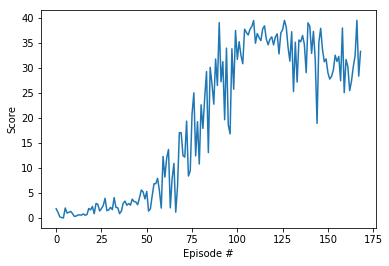

# Continuous Control Project Report

## Environment

This is an example of Deep Deterministic Policy Gradient reinformcement learning in a simple game environment.
The goal is to train a double-jointed arm to stay in a "goal" location, for which a reward is given.
There are two versions of this project: a single-arm version, and a multi-arm version. This is a solution to the single-arm version.

The environment is provided as a custom Unity project from Udacity, found here in the `Reacher_Linux` folder.
The environment has 33 states. Actions are a vector of four floating point numbers, describing the torque of two joints, ranging from -1.0 to 1.0..

The basic algorithm is based on the Deep Deterministic Policy Gradient code used in the pendulum assignment.
However, I had to try multiple hyperparameters to get it to converge in a reasonable amount of time.
In general, I found this assignment to be much more sensitive to hyperparameter settings than the previous one.
I got some good ideas for this from discussions in the associated course slack channel.
In particular, my learning rates were way too low, and the number of nodes in my networks were larger than needed.

## Settings

There are two models here, an actor and a critic, that perform the evaluation and improvement steps. These are basically the same as the defaults in the provided code, except that I set the two fully-connected layers to 128 nodes each, and added some batch normalization layers as per slack channel suggestions.

The ddpg_agent is also mostly the same. Here I ended up increasing the size of the memory buffer to 100000 entries, and doubled the batch size to 256. I also tried several learning rates and ended up going with .001 for both the actor and critic.

Here is a table of the hyperparameter settings:

File | Parm | Setting
-----|-----|-------
ddpg_agent | BUFFER_SIZE | 100000
ddpg_agent | BATCH_SIZE | 256
ddpg_agent | TAU | 0.001
ddpg_agent | LR_ACTOR | 0.001
ddpg_agent | LR_CRITIC | 0.001
model | actor fc1 | 128
model | actor fc2 | 128
model | critic fc1 | 128
model | critic fc2 | 128
main | seed | 123


## Outcome

The run I chose to represent here solved the environment (>13) in 371 episodes.

```
Episode 100	Average Score: 1.15
Episode 200	Average Score: 5.15
Episode 300	Average Score: 7.89
Episode 400	Average Score: 10.92
Episode 471	Average Score: 13.04
Environment solved in 371 episodes!	Average Score: 13.04

```




## Future Work

I experimented with parameters and this seems to meet the requirements for the class. I'm sure it's possible to do better. 
In particular, I can see in the class forum that some people have achieved results that faster, so there is room for improvement.

This only incorporates the main elements of the DQN algorithm, and borrows heavily from code created for some of the assignments.
In future I would like to add some additional improvements, such as prioritized experience replay and dueling DQN.


A second provided assignment is basically the same but with multiple arms, which provides opportunities for sharing learning across agents. It would be interesting to try that to compare the approaches and results.
